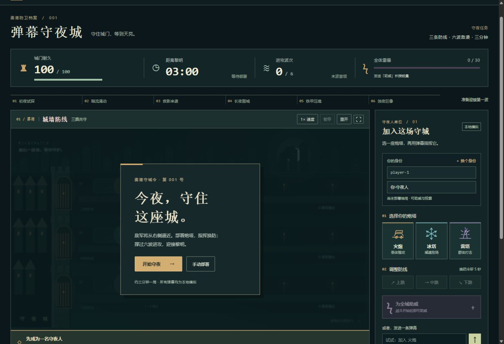

# 弹幕守夜城 · NIGHTWATCH

三分钟一局的三路合作塔防。观众通过弹幕加入炮塔、换防、助威和投票，守住雾港直到天亮。

当前版本 v0.3.1：战斗规则延续 v0.2，界面改为“雾港守备所”风格；输入框支持“召唤火炮”等自然写法，并明确区分普通弹幕与已执行的指令。

**当前为可运行的本地 Demo，所有互动均为模拟，尚未接入抖音或其他直播平台。**



**[在线试玩](https://tenyear-10.github.io/danmu-nightwatch/)** · [下载 Windows 试玩包](https://github.com/tenyear-10/danmu-nightwatch/releases)

## 直接试玩

下载 Release 中的 Windows 试玩包并解压，在 Windows 双击 **启动游戏.cmd**，保持命令窗口运行，浏览器打开：

http://127.0.0.1:4173/

也可以在项目目录执行：

```sh
node tools/serve.mjs
```

这是只监听本机地址的静态服务器，无额外运行依赖。不要直接双击 `dist/index.html`，浏览器对 ES Module 的本地文件限制可能导致白屏。

## 开发

验证环境：Node.js 24.19.0、pnpm 11.19.0。建议 Node.js 22.12+，使用附带的 pnpm-lock.yaml 固定依赖。

```sh
pnpm install --frozen-lockfile
pnpm dev
pnpm test
pnpm build
```

主要版本：Phaser 3.90.0、TypeScript 5.9.3、Vite 7.3.6、Vitest 3.2.7。

本项目选择 Phaser 3 稳定 API，与当前官方模板的更新版本不同。参考来源：https://github.com/phaserjs/template-vite-ts 。未复制其日志上传脚本。

如果已经有 `node_modules`，但特殊运行环境中的包管理器尝试重装依赖，可直接调用已安装的 CLI：

```sh
node node_modules/typescript/bin/tsc --noEmit
node node_modules/vitest/vitest.mjs run
node node_modules/vite/bin/vite.js build
node node_modules/vite/bin/vite.js --host 127.0.0.1
```

## 怎么玩

1. 点击“开始守夜”：三名演示队员已就位，五秒后战斗开始。也可选择“手动部署”。
2. 在右侧选择火炮、冰塔或雷塔，或在页面输入框发送“召唤火炮”“召唤冰塔”“召唤雷塔”；“加入 火炮”及无空格写法也可用。自己的昵称会出现在炮塔上方，每个观众 ID 只能占一个炮位。
3. 用上路、中路、下路按钮换防；成功后五秒冷却。
4. 点击助威积攒能量。每位观众三秒一次，30 能量自动触发全场雷暴。
5. 第 60、120 秒开启八秒升级投票，发送 1、2、3，或点击选项。
6. 180 秒内消灭全部六波和 Boss，且城门尚存，即为胜利。

“换个身份”可模拟另一个观众。全场十二个炮位，满员仍能助威和投票。支持 1× / 2× / 4× 演示速度、暂停、静音、全屏、重开。切到后台会暂停，需要手动继续。

页面输入框接收的是本地模拟弹幕。将“召唤火炮”发送到真实抖音直播间，目前不会进入游戏；真实平台适配器仍未实现。

## 作品发布

源码、测试和资源许可保存在本仓库；`node_modules/`、`dist/`、`artifacts/` 不提交。推送 `main` 后，GitHub Actions 验证并构建游戏，再发布到 GitHub Pages。Release 提供可离线启动的 Windows 试玩包。

演示观众每半秒从十八名模拟观众中轮流助威，投票时多数选增伤；末波时两名演示炮塔换到中路打 Boss，击败后回到原路。所有操作走正常弹幕入口，没有额外伤害或无敌。

## 已实现范围

- 固定 30 tick/s 逻辑，与 Phaser 显示分离。
- 三种炮塔：单体火炮、非叠加减速冰塔、最多三个目标的雷塔。
- 普通、快速、重甲、Boss 四种敌人，六波生成、城门伤害、胜败结算。
- viewerId 身份、重复事件防护、200 观众上限、每秒五条个人限流、500 条有界队列、每 tick 处理最多二十条。
- 两次升级投票、截止前改票、平票规则、全体技能、伤害和助威排行榜。
- 场景与特效程序绘制，音效本地合成，运行不访问外部服务。
- 守城档案式界面：本地字体、自绘 SVG 兵种图标、平面面板；无外部图片或字体请求。
- 开发观测台：FPS 估算、事件计数、拒绝原因、200 身份压力测试按钮。

## 结构

```text
src/config/balance.ts       所有主要数值
src/core/types.ts           事件、实体、状态的类型
src/core/GameSession.ts     唯一战斗状态及规则
src/input/commands.ts       纯函数解析指令
src/input/EventGateway.ts   校验、去重、限流、排队
src/input/MockAdapter.ts    模拟事件源和演示策略
src/input/stress.ts         压测身份池，预留自动观众的后续恢复位置
src/scenes/BattleScene.ts   程序绘图与战斗显示
src/main.ts                页面、交互、固定步进、生命周期
src/visual-theme.css        雾港守备所界面样式与窄屏结算布局
src/audio.ts               本地合成音效
tests/game.test.ts         规则、完整对局和压力回归
tools/serve.mjs            无额外依赖的本地构建包服务器
```

## 后续真实接入

实际平台适配器实现 `EventAdapter`，转换为 `InteractionEvent` 后调用 `GameSession.receive()`。不得绕过入口直接改变战斗数据。

```ts
{
  eventId: '唯一事件标识',
  sessionId: '当前 GameSession.id',
  viewerId: '稳定观众标识',
  displayName: '显示昵称',
  receivedAtMs: Date.now(),
  source: 'platform',
  payload: { type: 'chat', text: '加入 火炮' }
}
```

真实平台协议、授权范围和可用接口尚未核实。需要服务端签名或凭证时另建服务端，不放进前端。暂不包含付费礼物、持久账号、多直播间或公网部署。

## 验证、限制和交接

实际检查结果见 `验证记录.md`；两分钟展示流程见 `演示脚本.md`。

当前美术为程序绘制的原型风格，尚未加入定制精灵动画。数值经过固定案例验证，未经过大量真人测试。十二炮塔分配不合理也可能超时，应通过换防、助威改善结果。移动端有响应布局，但主要目标仍为 PC 浏览器。
